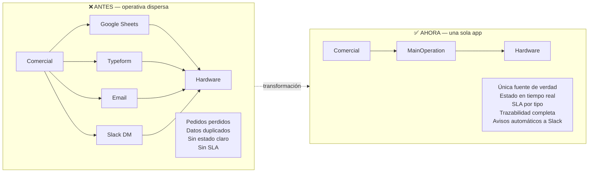

# Diagramas de MainOperation

Este archivo contiene los diagramas Mermaid de la app, versionados en git para que se actualicen junto al código. GitHub los renderiza automáticamente al abrir este archivo en la web.

Para iterar visualmente:
1. Abre <https://excalidraw.com>
2. Menú **Insert → Mermaid to Excalidraw**
3. Pega el bloque correspondiente
4. Ajusta colores/posiciones a gusto, **Save to file** → `.excalidraw`

---

## 1. Antes vs. Ahora

Cómo era la operativa de pedidos de Hardware antes de la app, y cómo es ahora.

---

## 2. Ciclo de vida de un pedido

Estados que atraviesa un pedido desde su creación hasta la entrega, con las ramas excepcionales (falta info, bloqueado) y los puntos donde se dispara aviso a Slack.

---

## 3. Arquitectura técnica

Piezas que componen el sistema y cómo se comunican.

---

## Versionado

Cualquier cambio relevante en flujos, estados o piezas de la arquitectura debería reflejarse en este archivo en el mismo PR. Si el cambio es solo cosmético (colores en Excalidraw), no hace falta — basta con actualizar el `.excalidraw` exportado si lo guardáis aparte.
